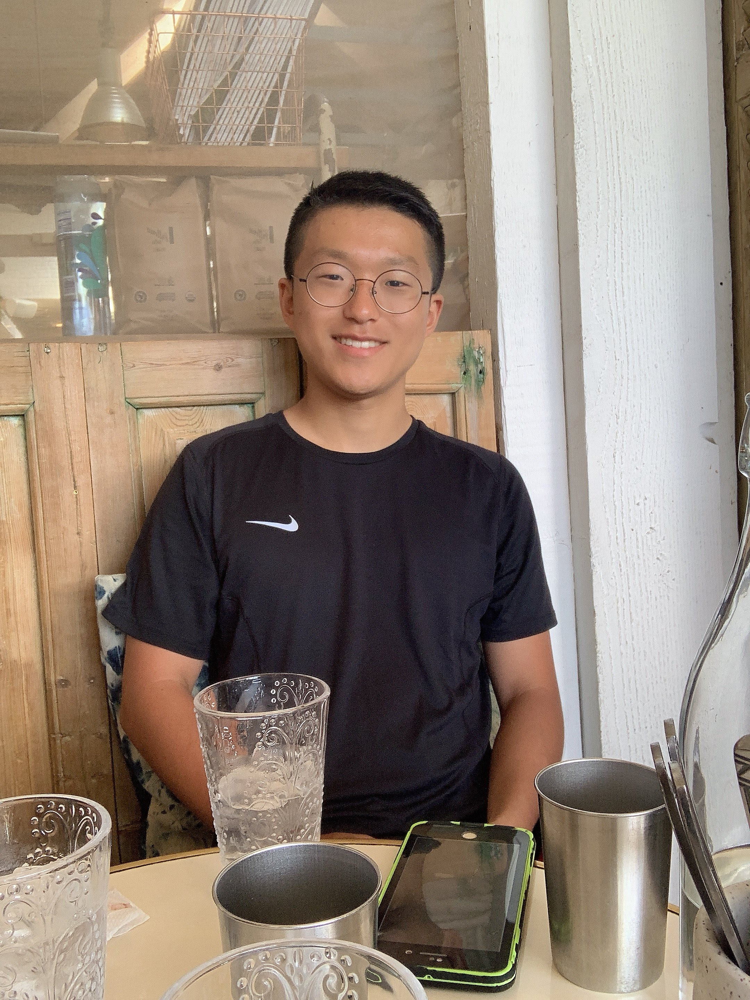
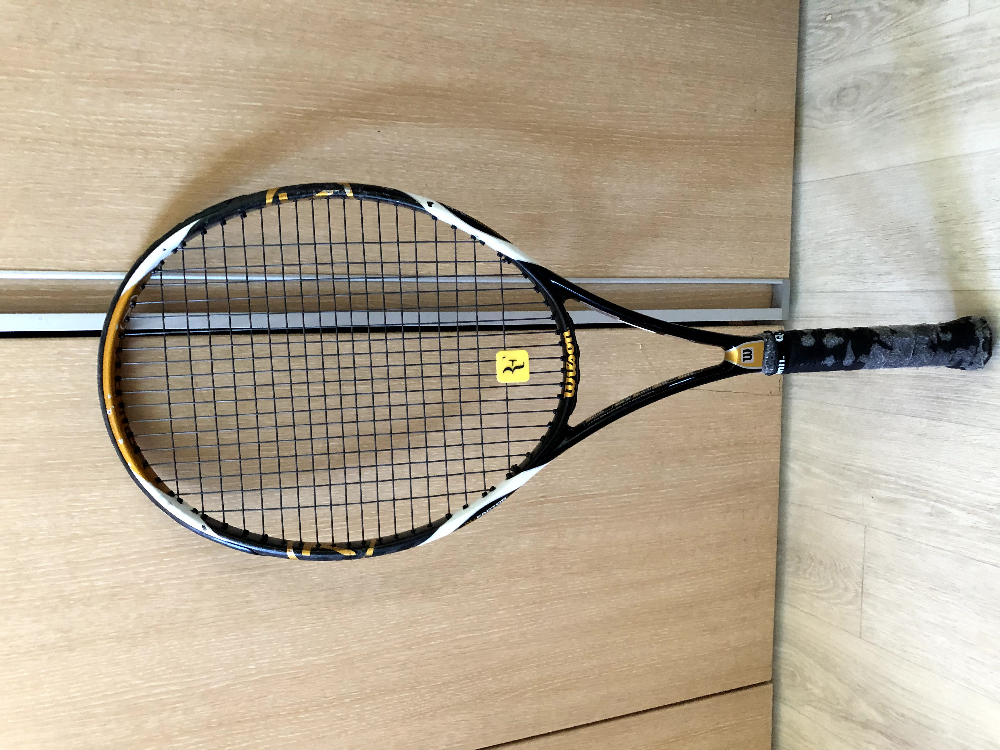
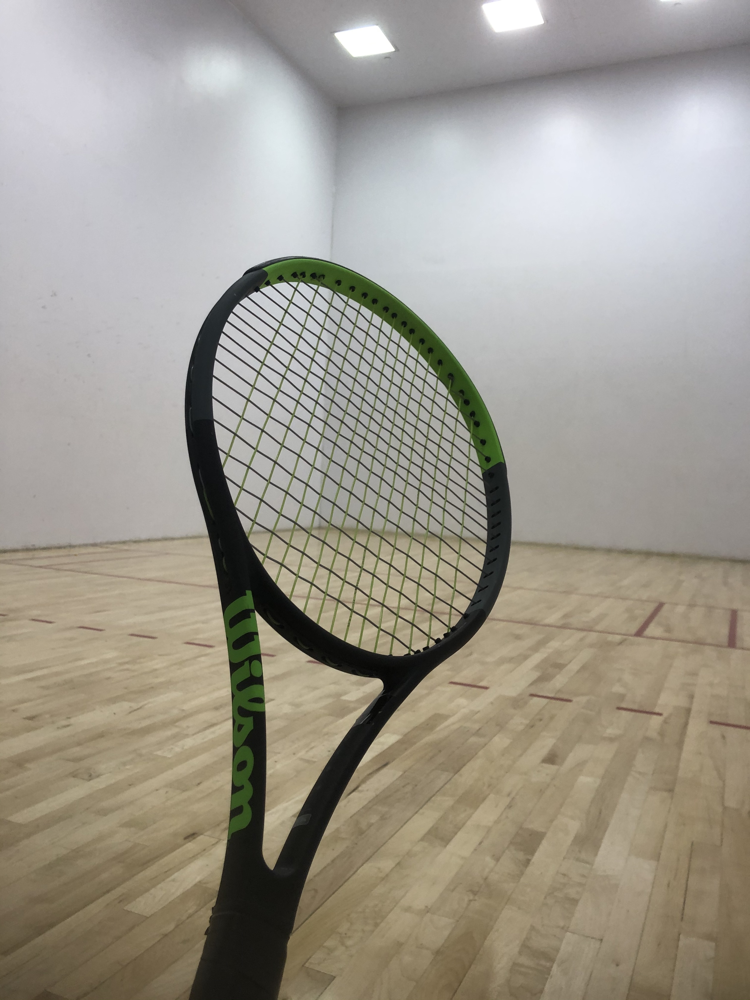
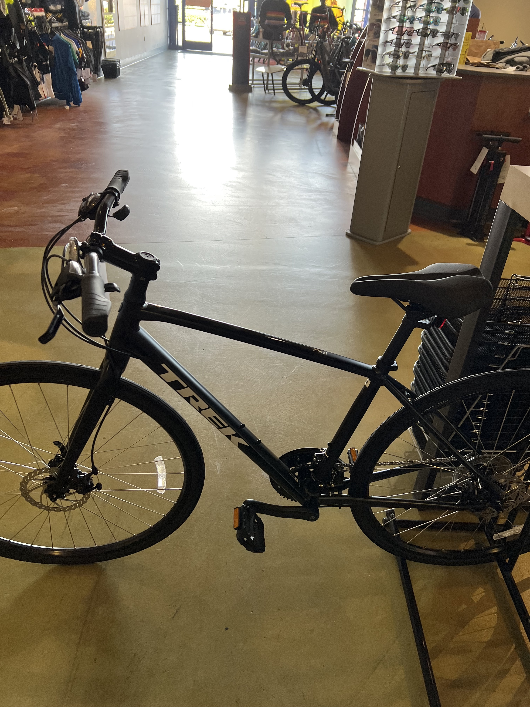

# Beomsu's Page

## About Me
> This is a quote
- [x] I like challenging myself
- [ ] I am good at programming
- [ ] I am ready for the class

Hello I am Beomsu Kim. I am a CE major in CSE department at UCSD. I will walk you through about myself with this site.

*Table of Contents*
- [Beomsu's Page](#beomsus-page)
  - [About Me](#about-me)
  - [Education](#education)
  - [Sports](#sports)
  - [Cooking](#cooking)

I love [powershell](README.md).
In powershell, I can get content of a file with the command `Get-Content`, `get-content`, or even with just `gc`. 
## Education
1. Powershell
2. C++
3. C#
   
I studied powershell by myself when I am serving military in the ROK. I was fascinated by its simple and intuitive design. I had fun playing with it a lot. ~~Moreover, the limitted access to information there alowed me to practice only it.~~
## Sports
- Tennis
- Bicycles

High physical ability is required to do well on tests. I believe that I need to be healthier for my sustainable academic growth. My favorite sports is tennis and I also like riding bicycles.
I like playing tennis. I especially like practicing with hitting a wall in Rimac indoor court. It is refreshing to be alone in a room. I can concentrate on myself there. Below is an image of my old racquet.  this is my old racquet. Below is the new one I puchased with the support of the government for recreaion.

I also like riding a bike. Since I don't have a car yet, it's the only transportation I have. Below is an image of my old bike I used to ride.

this is my old bike
 I got a new bike. Yayy! My parents bought it as a present for returning from serving military in the ROK.

This site was made with [GitHub Pages](https://pages.github.com/).

## Cooking
I love cooking. It is really expensive for me to buy a food. Also, I am feeling happy when I made some food. It gives me a feeling of achievement. I like using pork belly since it is cheaper here, plus it tastes good. I can get lard if I want. Recently, I am into baking. I haven't baked anything though. I went to *The Republic* in Los Angeles just before the quarter starts. It tastes so good that I decided to start baking. I watched videos of tutorial of how to bake. I am glad to say that my baking skill is improving. Personally, I love tresleches cake. I want to make it some day. I like challenging myself to test my own limits.